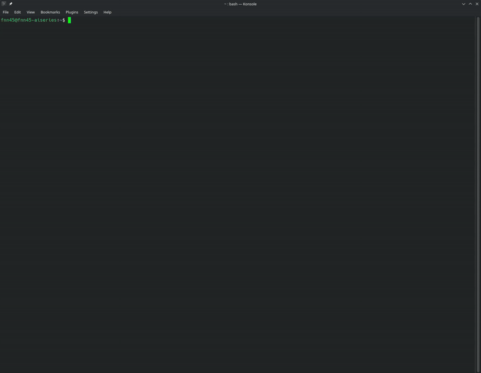
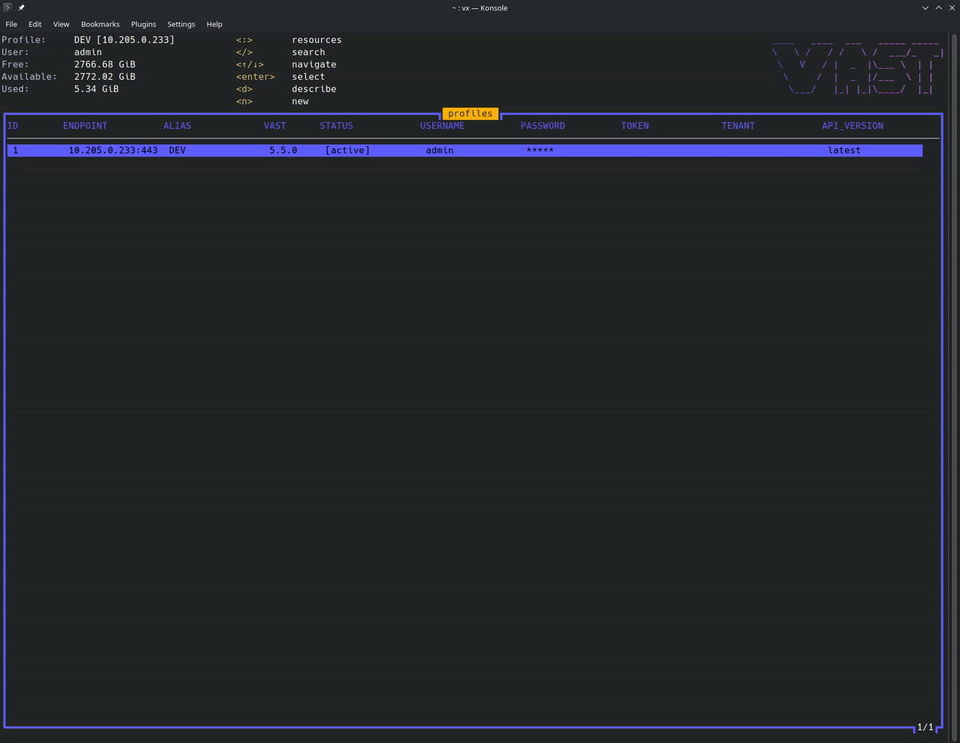
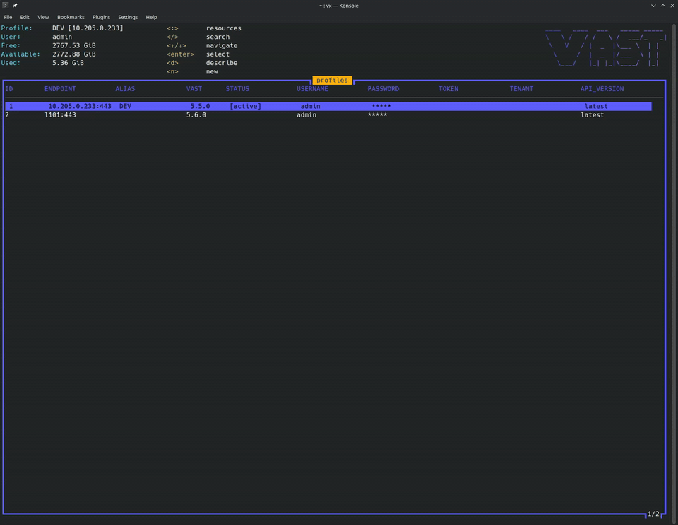
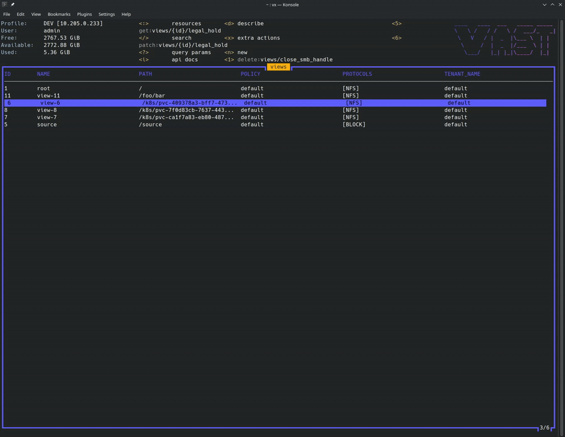

# Vastix - TUI for go-vast-client

Vastix is a Terminal User Interface (TUI) application that provides an interactive interface for using [go-vast-client](https://github.com/vast-data/go-vast-client). It offers capabilities for managing and testing VAST Data resources.

## ⚠️ Beta Status

**This tool is currently in beta and should NOT be considered an official VAST client.**

## Background

The go-vast-client library includes autogenerated code that generates resources from the VAST API's Swagger schema. 
Due to the extensive size of the VAST API, manually testing every endpoint
and resource type became impractical. 

Vastix was created to address this challenge by providing TUI for interactive testing and exploration 
of go-vast-client resources.

## Getting Started

### Prerequisites

- Access to a VAST Data cluster

### Building the Application

To build the vastix binary:

```bash
make build
```

This will create the executable at `bin/vastix`.

### Running the Application

To build and run vastix:

```bash
make run
```

### Installing the Application

To install vastix system-wide as the `vx` command:

```bash
make install
```

This installs the binary to `/usr/local/bin/vx` (requires sudo). After installation, you can run:

```bash
vx
```

### Uninstall

```bash
make uninstall
```

## Quick Start Walkthrough

### 1. Create your first profile

On first launch Vastix opens the **Profiles** screen. Create a connection to your VAST cluster and optionally set a short alias.

| Step | Keys / action |
|------|----------------|
| Move between fields | `Tab` / `Shift+Tab` |
| Submit profile | `Ctrl+s` |

Fill in at least **endpoint**, **username**, and **password** (or token). **Alias** is optional but useful when you manage multiple clusters.



### 2. Add a second profile and switch

Create another profile, then switch the active connection without restarting the app.

| Step | Keys / action |
|------|---------------|
| Create another profile | `n` |
| Select a different profile | `↑` / `↓` then `Enter` |

The `[active]` marker and the profile header (top-left) update when you switch.



### 3. Browse resources, view details, and create a view

Use the resource picker to open any VAST API resource, inspect a record, and create a new one. This demo uses **views**.

| Step | Keys / action                       |
|------|-------------------------------------|
| Open resource picker | `:`                                 |
| Filter resource types (optional) | `/` then type to search             |
| Select resource type | `Enter`                             |
| Navigate list | `↑` / `↓`                           |
| Open record details | `Enter` or `d`                      |
| Go back to list | `Esc`                               |
| Create new resource | `n` → fill form → `Ctrl+s` (submit) |



### 4. Delete a resource

Remove the view created in the previous step.

| Step | Keys / action |
|------|----------------|
| Select the resource | `↑` / `↓` |
| Delete | `Ctrl+d` |
| Confirm | `y` or `Enter` |
| Cancel | `n` or `Esc` |



